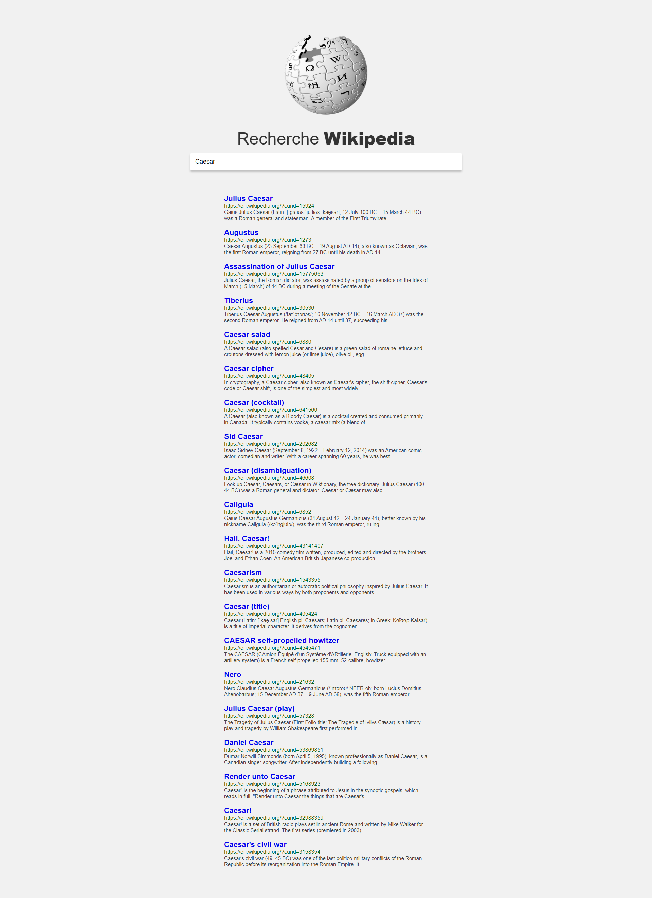

# Udemy - 20 javascript projects - Wikipedia apI App

This is a solution to the [Wikipedia api App from Udemy](https://www.udemy.com/course/20-projets-en-javascript/).

## Table of contents

- [Overview](#overview)
  - [The challenge](#the-challenge)
  - [Screenshot](#screenshot)
  - [Links](#links)
- [My process](#my-process)

  - [Built with](#built-with)
  - [What I learned](#what-i-learned)
  - [Continued development](#continued-development)

- [Author](#author)

## Overview

### The challenge

Users should be able to:

- Manage the search input through the form and the input.
- Use the Wikipedia API to get the results of this search.
  I give you the endpoint (URL) because it is one of the first projects and the doc is not very clear:

https://en.wikipedia.org/w/api.php?action=query&list=search&format=json&origin=*&srlimit=20&srsearch=${searchInput}

- Use the api using the fetch() method by including the search content here: ${searchInput}.

- Add a loader while loading.
- Display the results below the input.
- Make sure we can do as many searches as we want.
- Bonus: Handle possible errors with the fetch() method

### Screenshot

### Links

- Solution URL: [Github link](https://github.com/Stv-devl/Wikipedia-APY---FR)
- Live Site URL: [Live link](https://stv-devl.github.io/Wikipedia-APY---FR/?)

## My process

### Built with

- Semantic HTML5 markup
- CSS custom properties
- Flexbox
- CSS Grid
- Mobile-first workflow
- SASS / SCSS
- Vanilla JS
- API

### What I learned

I learned to practice javascript. And use API

### Continued development

## Author

- Website - [Github](https://github.com/Stv-devl)
